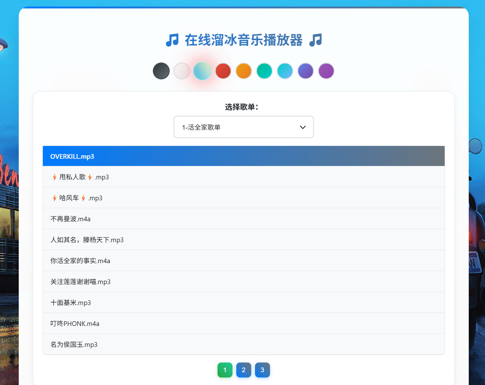

# 在线音乐播放器



一个功能丰富的Web音乐播放器，支持歌词显示、自选歌单播放和多种配色方案。

如果你正打算从B站收藏夹搬运音乐用于此播放器，建议你使用项目[bilibili-video2mp3](https://github.com/wxsms/bilibili-video2mp3)将视频转为Mp3音频。本项目已经内置了基于此工具的一个批量下载脚本。

## B站视频批量下载脚本

脚本为[bilibili-video2mp3](https://github.com/wxsms/bilibili-video2mp3)设计。

### 环境要求
不论您尝试在哪运行这个脚本（部署此播放器的服务器，或本地开发环境），都应该确保安装了以下的依赖。
- Python 3.6+（运行环境）
- Node.js（下载工具运行环境）
- FFmpeg（下载工具格式转换）

### 安装依赖

前往[bilibili-video2mp3](https://github.com/wxsms/bilibili-video2mp3)安装下载工具。

### 使用方法
```bash
# 正常模式（检查环境）
python download/download.py

# 跳过环境检查
python download/download.py --skip-check

# 调试模式
python download/download.py --debug
```

### 使用步骤
1. 运行脚本
2. 直接粘贴B站分享文本（如：【视频标题】 https://www.bilibili.com/video/...），脚本会自动提取URL
3. 选择保存目录（download目录、现有歌单目录或创建新歌单）
4. 确认下载
5. 等待下载完成

音频文件将保存到当前目录，可直接放入 `music/` 文件夹使用。

## 主要功能

- 🎵 支持多种音频格式（MP3、M4A、AAC等）
- 📄 自动歌词显示和翻译支持
- 🎨 8种配色方案，流畅动画
- 📱 分页加载，每页10首歌曲
- 🌐 自由多选歌单播放功能
- ⚡ 智能歌词缓存系统，支持大规模歌单
- 🚀 歌词预加载功能，提升用户体验

## 待完成功能

- 多用户；
- 歌曲搜索功能，能允许用户在整个曲库（所有歌单），还是在当前选中的歌单中搜索；
- 允许播放器主体以悬浮窗形式在所部署的网站的其他页面打开；
- 将爬取B站歌单功能图形化，集成入播放器页面；

## 快速开始

1. 克隆本项目至您的网站（要求具有能运行PHP的后端）
2. 将音乐文件放入 `music/` 文件夹下的子文件夹中
3. 如需显示歌词，将歌词文件放入 `lyrics/` 文件夹下对应的歌单文件夹中
4. 重新启动Web服务器
5. 访问 `index.html` 开始使用

## 歌词文件格式

使用标准LRC格式，支持翻译（同时间戳的后一句会被认为是翻译）：

```
[00:00:00]Hello World!
[00:00:00]你好世界!
```

### 歌词文件选择逻辑

播放器采用智能歌词选择机制，支持专用歌词和通用歌词：

**查找逻辑：**
- **统一歌词目录**：`lyrics/歌单/歌词文件.lrc`
  - 优先查找专用歌词：`歌曲名-歌手名.lrc`
  - 备选通用歌词：`歌曲名.lrc`

**使用场景：**
- **专用歌词**：当翻唱版本有特殊歌词时使用（如：`吹灭小山河-法里达.lrc`）
- **通用歌词**：当多个翻唱版本共享相同歌词时使用（如：`吹灭小山河.lrc`）

**推荐存储结构：**
```
项目根目录/
├── music/
│   ├── 歌单1/
│   │   └── 歌曲1.mp3
│   └── 歌单2/
│       └── 歌曲2.mp3
└── lyrics/                    ← 统一歌词文件夹
    ├── 歌单1/
    │   ├── 歌曲1-歌手名.lrc    ← 专用歌词
    │   └── 歌曲1.lrc          ← 通用歌词
    └── 歌单2/
        └── 歌曲2.lrc
```

**示例：**
```
歌曲文件：吹灭小山河-法里达.mp3
歌词文件：lyrics/歌单/吹灭小山河-法里达.lrc  ← 优先使用（专用歌词）
歌词文件：lyrics/歌单/吹灭小山河.lrc         ← 备选方案（通用歌词）
```

### 性能优化

播放器内置了智能性能优化系统，特别适用于大规模歌单：

**缓存机制：**
- **索引缓存**：预建歌词文件索引，避免重复文件系统扫描
- **内存缓存**：缓存已加载的歌词内容，避免重复网络请求
- **批量处理**：支持一次性获取多个歌词文件，减少HTTP请求

**性能特性：**
- **预加载**：在用户浏览歌单时自动预加载歌词
- **索引优化**：仅扫描统一歌词目录，大幅提升性能
- **缓存管理**：自动清理过期缓存，支持手动清除

**适用场景：**
- 大型歌单（>100首歌曲）
- 频繁切换歌曲
- 多用户并发访问
- 歌词文件数量庞大

**调试功能：**
在浏览器控制台中可使用以下命令：
```javascript
// 查看歌词缓存状态
console.log(window.lyricsCache);

// 清除歌词缓存
window.clearLyricsCache();
```

## 文件结构

```
music_player/
├── index.html
├── style.css
├── script.js
├── backend.php
├── music/
│   ├── 歌单1/
│   │   └── 歌曲1.mp3
│   └── 歌单2/
│       └── 歌曲2.mp3
└── lyrics/                    ← 统一歌词文件夹（推荐）
    ├── 歌单1/
    │   ├── 歌曲1-歌手名.lrc    ← 专用歌词
    │   └── 歌曲1.lrc          ← 通用歌词
    └── 歌单2/
        └── 歌曲2.lrc
```

## 技术栈

- 前端：HTML5、CSS3、JavaScript
- 后端：PHP
- 音频：HTML5 Audio API

## 许可证

MIT License
