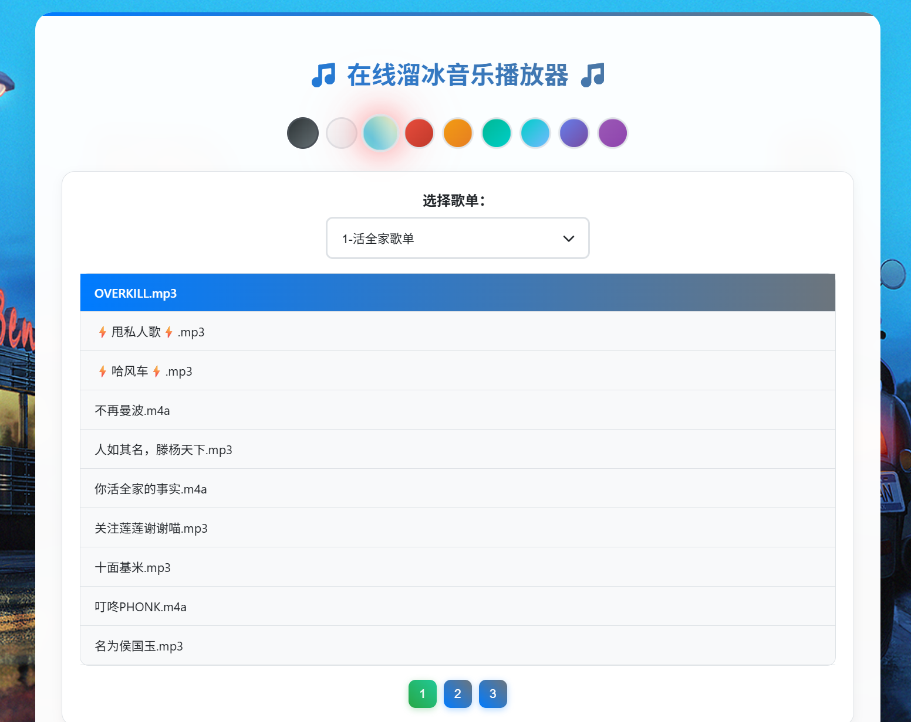

# 音乐播放器

部署在 VPS 上的轻量 Web 音乐播放器，以 popup 窗口形式嵌入其他站点使用。



## 应用场景

- 在个人网站中嵌入一个 popup 音乐播放器
- VPS 持久运行，随时访问
- 支持多歌单管理和歌词显示

## 部署

### 环境要求

- **Python 3.6+**（唯一运行时依赖）
- Linux 服务器（推荐 Debian/Ubuntu），亦可在 macOS/Windows 下运行
- 约 50MB 磁盘空间（含依赖），音乐文件另计

### 快速启动（开发/测试）

```bash
git clone <repo>
cd music-player
./start.sh           # Linux/macOS
# 或
start.bat            # Windows
```

`start.sh` 会自动完成：检查 Python → 创建虚拟环境 → 安装依赖 → 启动服务。

启动后访问 `http://localhost:8080`。传入额外参数可自定义端口：

```bash
./start.sh --port 3000
```

### 生产部署（VPS 持久运行）

以下以 Debian/Ubuntu 为例，假设部署路径为 `/srv/music-player`。

#### 1. 创建专用用户

以隔离权限，避免使用 root：

```bash
sudo useradd -r -s /bin/false music
```

`-r` 创建系统用户，`-s /bin/false` 禁止登录。

#### 2. 克隆项目

```bash
sudo git clone <repo> /srv/music-player
```

#### 3. 设置权限

```bash
# 项目文件归专用用户所有
sudo chown -R music:music /srv/music-player

# music/ 目录需要写入权限（添加歌曲）
sudo chmod 755 /srv/music-player/music
```

如需通过 SFTP 上传音乐文件，可将你自己的用户加入 `music` 组：

```bash
sudo usermod -aG music <your-username>
sudo chmod 775 /srv/music-player/music
```

#### 4. 创建虚拟环境并安装依赖

```bash
cd /srv/music-player
sudo -u music python3 -m venv venv
sudo -u music venv/bin/pip install -r requirements.txt
```

#### 5. 配置 systemd 服务

```bash
sudo tee /etc/systemd/system/music-player.service << 'EOF'
[Unit]
Description=Music Player
After=network.target

[Service]
Type=simple
User=music
Group=music
WorkingDirectory=/srv/music-player
ExecStart=/srv/music-player/venv/bin/python server.py --host 127.0.0.1 --port 8080
Restart=always
RestartSec=5

# 安全加固
NoNewPrivileges=yes
ProtectSystem=strict
ProtectHome=yes
ReadWritePaths=/srv/music-player/music
ReadOnlyPaths=/srv/music-player

[Install]
WantedBy=multi-user.target
EOF
```

> `--host 127.0.0.1` 使服务仅监听本地。如需直接对外暴露，改为 `--host 0.0.0.0`，并确保配置了防火墙。

#### 6. 启动服务

```bash
sudo systemctl daemon-reload
sudo systemctl enable --now music-player
```

#### 7. 管理服务

```bash
# 查看状态
sudo systemctl status music-player

# 查看最近日志
sudo journalctl -u music-player -n 50 --no-pager

# 实时跟踪日志
sudo journalctl -u music-player -f

# 重启（更新代码或配置后）
sudo systemctl restart music-player

# 停止
sudo systemctl stop music-player

# 禁用开机自启
sudo systemctl disable music-player
```

### 反向代理（可选）

如需通过 Nginx 反代（搭配 HTTPS、域名、路径前缀等）：

```nginx
location /music/ {
    proxy_pass http://127.0.0.1:8080/;
    proxy_set_header Host $host;
    proxy_set_header X-Real-IP $remote_addr;
}
```

并在 `server.py` 中保持 `--host 127.0.0.1`。

### 防火墙

如果服务直接对外暴露（`--host 0.0.0.0`），需开放端口：

```bash
# ufw
sudo ufw allow 8080/tcp

# firewalld
sudo firewall-cmd --add-port=8080/tcp --permanent
sudo firewall-cmd --reload
```

### 嵌入为 popup

```html
<a href="#"
   onclick="window.open('http://<host>:8080','music','width=420,height=640');return false">
  打开播放器
</a>
```

## 使用

### 添加歌曲

在 `music/歌单名/` 下为每首歌创建一个文件夹，放入音频文件：

```
music/
└── 我的歌单/
    ├── 追光者-岑宁儿/
    │   ├── 追光者.mp3
    │   └── 追光者.lrc
    └── 起风了-买辣椒也用券/
        └── qifengle.m4a       ← 文件名随意，文件夹名决定显示名
```

- 音频格式支持：MP3、M4A、AAC、WAV、OGG、FLAC
- 文件夹名即为歌曲显示名
- 歌词文件（`.lrc`）可选，放入同一文件夹即可

### 歌词格式

标准 LRC 格式。同一时间戳出现两行时，前一行视为原文、后一行视为翻译：

```
[00:15.28]曾羡慕闲云野鹤 作客人间
[00:15.28]I once envied the wandering clouds and wild cranes
[00:18.28]寄情于天地有灵 草木无邪
[00:18.28]Entrusting feelings to the spirits of heaven and earth
```

### B站下载工具

内置批量下载脚本，用于从B站收藏夹搬运音乐。需额外安装 Node.js 和 FFmpeg。

```bash
python download/download.py
```

详见 `download/` 目录。

## 技术栈

- 前端：HTML5、CSS3、JavaScript（零外部依赖）
- 后端：Python Flask
- 音频：HTML5 Audio API

## 许可证

MIT License
